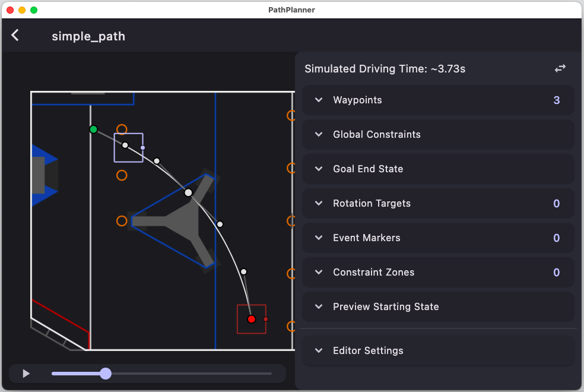

# Path Following with PathPlanner

This project runs experiments with the RamseteCommand with [PathPlanner](https://github.com/mjansen4857/pathplanner/wiki).  PathPlanner can be downloaded from the Microsoft Store or the Apple App Store.

If you specify PathPlanner's project as being your WPILib robotics directory, PathPlanner will manage its trajectories as JSON files under `src/main/deploy/pathplanner`.



## Trajectories

Trajectories can be created and edited within the PathPlanner app.  The can also be constructed manually in code.

Here's an example:
The first waypoint will be 0.6 meters forward and 0.3 meters to the right (about 2 feet forward and 1 foot right).  The second waypoint will be 1 meter forward of the starting point.  The third waypoint will be heading back towards the starting point but to the left of the start.  The ending point should be even with the starting point but 0.3 meters to the left.
```java
    PathPlannerTrajectory loopTrajectory = PathPlanner.generatePath(
        pathConstraints,
        new PathPoint(new Translation2d(0.0, 0.0), Rotation2d.fromDegrees(0)), 
        new PathPoint(new Translation2d(0.6, -0.3), Rotation2d.fromDegrees(0)), 
        new PathPoint(new Translation2d(1.0, 0.0), Rotation2d.fromDegrees(90)), 
        new PathPoint(new Translation2d(0.6, 0.3), Rotation2d.fromDegrees(180)), 
        new PathPoint(new Translation2d(0.1, 0.3), Rotation2d.fromDegrees(180)), 
        new PathPoint(new Translation2d(0.0, 0.3), Rotation2d.fromDegrees(180)) 
    );
```
