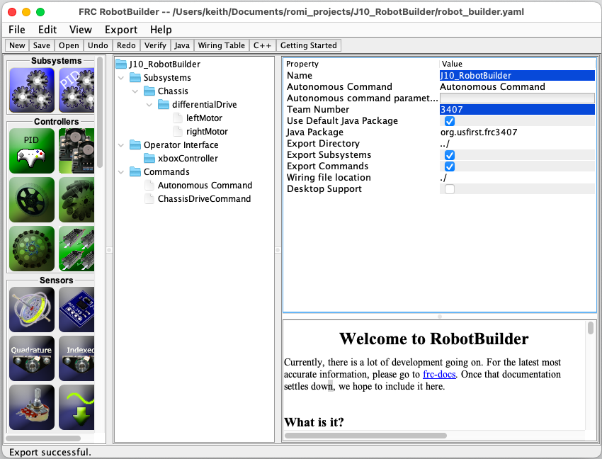

# Command-driven robot constructed with RobotBuilder

This project was generated almost entirely with [RobotBuilder](https://docs.wpilib.org/en/latest/docs/software/wpilib-tools/robotbuilder/index.html).

The only coding necessary was to add the `arcadeDrive()` method to the `Chassis` subystem and also to modify the `ChassisDriveCommand` so it calls `arcadeDrive`.

You may need to copy a `build.gradle` file from another Romi project, since the RobotBuilder generated file might not work with Romi's.

